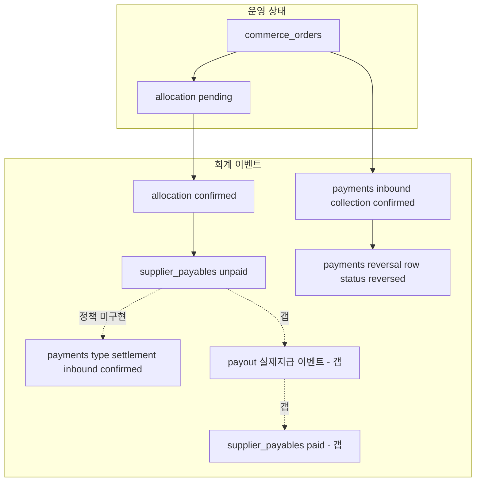

# ACCOUNTING-LIFECYCLE-DESIGN-001 — settlement / payout / reversal chain lifecycle 설계

> **범위**: 설계 문서만. 코드·migration 실행·DB 변경 없음.  
> **전제(고정)**: `DECISIONS.md` **[D-021]**(append-only·overwrite 금지·reversal row 방향), **[D-022]**(taxonomy enforcement 순서·`type='settlement'` transition 유지·legacy `type` NULL), `payments` hybrid SSOT, storefront KPI reversal-aware P0 완료.  
> **근거 코드(검증 시점)**: 저장소 `realmyos` — 주로 `src/actions/admin/settlement-control.ts`, `commerce-allocation.ts`, `commerce-reversal.ts`, `supplier-payables.ts`, `platform-revenue.ts`, `src/actions/payment.ts`, `supabase/migrations/20260515220000_create_supplier_payables.sql`, `20260507060000_create_reverse_disbursement.sql`, `20260515500000_add_reversal_fields.sql`.

---

## SECTION 1 — 사전 확인 결과 (settlement / payout / payable / reversal / KPI, 코드 기준)

### 1.1 Settlement (`settlement-control.ts` + UI)

| 항목 | 사실(코드) |
|------|------------|
| **`processSettlement`** | RFQ `orders.id`만 대상. `orders.status === 'confirmed'` 필수. 동일 `order_id`에 대해 `type='settlement'`·`status='confirmed'` 가 이미 있으면 거절. |
| **생성 row** | `payments` **INSERT** — `direction: 'inbound'`, `status: 'confirmed'` (**즉시 확정**), `type: 'settlement'`, `amount = round(orderAmount × platform_fee_rate / 100)`, `order_id`, `payer_tenant_id` = 공급자 테넌트, `payee_tenant_id: null`, `payment_method: 'platform'`. |
| **완료 기준** | INSERT 성공 = 화면·KPI 상 “정산 기록” 존재. **별도 `pending` 단계 없음**. |
| **`supplier_payables` 연결** | **없음**. settlement는 RFQ 주문·수수료율만 사용. |
| **`settlement_cycle_days`** | `admin_settings` 키 `settlement_cycle_days` — `getPendingSettlements`에서 `overdue_risk = days_pending > cycle_days` 에만 사용. **`processSettlement` 게이트에는 미사용**. |
| **`getAutoSettlementSuggestions`** | 후보 필터에 **`days > 30` 고정** — **`settlement_cycle_days` 와 불일치**. |
| **취소** | settlement row **삭제·역INSERT 전용 함수 없음**(본 파일 기준). |
| **`settlement_memo`** | 선택 인자 → `payments.settlement_memo` 저장. UI placeholder에 “이체완료” 예시. |
| **UI** | `/admin/settlements` — KPI(`getPlatformRevenue` 등) + `SettleOrderButton` → `processSettlement`. |
| **KPI·집계** | `getPlatformRevenue`: 월 GMV = 해당월 `orders` confirmed 합; `month_settled_amount` = 해당월 **`payments` `type=settlement`·`confirmed`** 합; `pending_settlement_amount` = confirmed 주문 중 settlement 미존재 주문 금액 합. **`getUnifiedSettlementView`**: 주문별 `paid_amount` = 동 주문 **inbound·confirmed·`type != settlement'`** 합; `settled_amount` = **`type=settlement'`** 합. |

### 1.2 Payout / disbursement (플랫폼 storefront 외 축)

| 항목 | 사실(코드) |
|------|------------|
| **storefront “payout” 전용 함수** | **없음** — `supplier_payables` 를 `paid` 로 바꾸는 **TS 액션 미발견**(저장소 `grep` 기준). |
| **지급 RPC** | `payment.ts` — `create_disbursement_with_allocations` RPC, `reverse_disbursement` RPC (공급자OS 지급·매입 축). |
| **`reverse_disbursement`** | 대상 `payments` **UPDATE** `status = 'reversed'` (**append-only reversal row 아님**). `payment_allocations` + `purchases.status` 재계산. |
| **storefront payable vs outbound `payments`** | **연결 코드 없음** — payable은 allocation 확정 시 `unpaid` INSERT 까지가 P0 범위. |

### 1.3 `supplier_payables` lifecycle

| 항목 | 사실(코드·migration) |
|------|----------------------|
| **생성** | `confirmCommerceAllocation` → `createSupplierPayableFromAllocation`: allocation **`confirmed`** 일 때만 INSERT, **`status: 'unpaid'`**, `confirmed_at`/`confirmed_by` 설정. |
| **상태값** | migration CHECK: **`unpaid` \| `paid` \| `cancelled`**. |
| **`paid` 전이** | **애플리케이션 코드에서 `paid` 로 UPDATE 하는 경로 없음**(검색 결과). |
| **취소** | `cancelSupplierPayableWithClient`: **`unpaid`만** `cancelled` + 메타 컬럼. **`paid` 는 거절** + `commerce_payable_manual_review_required` 로그. |
| **주문 취소 시** | `processCommerceOrderCancelledAccountingP0`: unpaid → cancel 시도; paid → 수동 검토 로그만. |

### 1.4 Reversal chain (`payments`)

| 항목 | 사실(코드·migration) |
|------|----------------------|
| **구조** | `reversal_of_id` self-FK, `reversal_reason`, `reversed_by`, `reversed_at`. |
| **유니크** | `payments_commerce_order_id_primary_unique`: `commerce_order_id` NOT NULL **且** `reversal_of_id` IS NULL 일 때 주문당 1건. **`payments_reversal_of_id_unique`**: `reversal_of_id` NOT NULL 일 때 **유니크** → **원본당 reversal child 최대 1건**. |
| **storefront reversal row** | `createPaymentReversalRowInternal`: 원본 **inbound·confirmed·`reversal_of_id` null** 1건 조회 후, 동일 금액·`status: 'reversed'`(상쇅 row)·`reversal_of_id` 설정 INSERT. 중복 시 skip/`23505` 처리. |
| **reverse of reversal** | **본 설계 턴에서 자동 생성 경로 없음**. DB상으로는 “reversal row를 원본으로 하는 또 다른 reversal row” 이론상 가능하나, **KPI·운영 정책 미정의**. |
| **`reverse_disbursement` vs append-only** | **별 축**: outbound 지급은 **UPDATE reversed**; storefront inbound 취소는 **INSERT reversal row**. **동일 테이블 `payments`에 패턴 공존**. |

### 1.5 KPI 반영 시점

| KPI / 함수 | 사실(코드) |
|-------------|------------|
| **`getStorefrontRevenueKPI`** | Gross: `commerce_order_id` NOT NULL, inbound, `payee=플랫폼`, **`status=confirmed`**, **`reversal_of_id` null**. Reversal 합: 동일 범위에서 **`reversal_of_id` not null**. 일·월 구간 = **`payment_date`** 문자열(KST 날짜). **`supplier_payable_total`**: `supplier_payables` 중 **`unpaid`+`paid`** 금액 합(취소 제외). **`platform_margin`** = `total_revenue` − 위 합. |
| **RFQ KPI(동 파일)** | `orders` confirmed 금액 합(일·월·총) — **settlement·reversal 미연동**. |
| **`getPlatformRevenue` 등** | RFQ **settlement `payments`** 및 **orders GMV** — **storefront `commerce_orders` / reversal 와 분리**. |

---

## SECTION 2 — settlement 의미 확정 (옵션 A/B/C 비교 + 권장안)

### 2.1 현재 코드 기준 실제 semantics

- **`processSettlement`이 만드는 것**은 “공급자→플랫폼 **수수료**의 **원장상 확정 기록**”에 가깝다. **은행 입금 완료**·**공급자에게 매입대금 지급 완료**를 증명하지 않는다.
- **주문(`orders`) 1건당 settlement `payments` 최대 1건**(중복 INSERT 방지).
- **정산 주기 설정값**은 UI 리스크 표시·후보 추천에 **부분적으로만** 쓰이고, **핵심 INSERT 조건과 불일치**(§1.1 `30`일 고정 vs `cycle_days`).

### 2.2 옵션 비교

| 기준 | **A: settlement = 정산(수수료) 확정 이벤트** | **B: settlement = 실제 지급 완료** | **C: settlement = 정산 주기 마감 이벤트** |
|------|-----------------------------------------------|--------------------------------------|--------------------------------------------|
| 현재 코드 일치 | **높음** (수수료 계산·즉시 `confirmed`) | **낮음** | **낮음** (주기=보조 알림 수준) |
| append-only 적합 | **높음** (INSERT 이벤트로 해석 가능) | 은행 사실은 보통 별도 증빙 | 주기 마감은 별도 “closing” 엔티티가 자연스러움 |
| KPI(`getPlatformRevenue`) | **현행과 일치** | 불일치 | 불일치 |
| reversal | 코드상 전용 없음 → **정책으로 후속** | 은행 확정 후 reversal 어려움 | 마감 rollback 난이도 높음 |
| supplier 관점 | “플랫폼에 낼 **수수료가 확정**됨”에 가까움 | “돈이 나갔다”와 혼동 위험 | 기간 합산과 혼동 |
| payout 충돌 | **낮음** — payout은 별 이벤트로 둘 여지 | settlement=payout 시 **용어 충돌** | 용어는 분리 가능하나 코드와 어긋남 |

### 2.3 권장안 (목표 accounting semantics)

- **권장: 옵션 A를 채택하되, 용어를 “정산 확정(수수료 인식)”으로 명시적으로 좁힌다.**  
  - **[D-022]**에 따라 DB `type` 문자열은 당분간 **`settlement` 유지**(transition taxonomy).  
  - **의미(회계)**: `settlement` row = **RFQ 주문 단위 플랫폼 수수료의 accrual/recognition 을 관리자가 버튼으로 원장에 올린 시점**이다.  
  - **반드시 아닌 것(현행 코드와의 정합)**: 공급자 **매입대금 payout 완료**, **은행 이체 완료**, **`supplier_payables` 확정/지급**과 동일시하지 않는다.

### 2.4 현행 vs 목표

| 구분 | 현행 | 목표(본 문서 권장) |
|------|------|----------------------|
| 의미 | UI·주석상 “정산” 통칭, 일부 placeholder는 이체 언급 | **수수료 회계 확정 이벤트**로 문서·운영 언어 정렬 |
| 주기 | `cycle_days` vs `30`일 힌트 **혼재** | 단일 기준(정책 결정) + 코드 정합 후속 |
| finality | `confirmed` 즉시 | **§10** 에서 시점 정의 후 구현 반영 |

---

## SECTION 3 — payout 의미 확정 (옵션 A/B 비교 + 권장안)

### 3.1 “실제 돈 이동” vs “회계 이벤트 확정”

- **실제 돈 이동**: 은행 API·현금영수증·대사 완료 등 **외부 세계의 사실**.  
- **회계 이벤트 확정**: SSOT 원장에 **의미가 고정된 행(또는 append-only 상쇄 행)** 이 생긴 시점.  
- 현재 **storefront 공급자 지급**은 원장상 **`supplier_payables.unpaid`** 에 머물 수 있고, **`paid` 로 옮기는 앱 경로가 없음** → **payout 회계 이벤트가 SSOT에 비어 있음**.

### 3.2 옵션 비교

| 기준 | **A: payout = 실제 은행 송금(또는 동등 최종 자금이전) 완료** | **B: payout = 지급 승인(내부 승인만)** |
|------|---------------------------------------------------------------|----------------------------------------|
| settlement 관계 | **분리** — settlement(수수료) 후·선행과 무관하게 별도 추적 가능 | settlement 완료와 동일시하기 쉬워 **현 코드와 충돌** |
| reversal | 사실 확정 후 **조정/adjustment** 중심(어려움) | 승인 취소는 **상대적 용이**하나 **은행 사실과 괴리** 위험 |
| KPI | **지급·미지급 부채** 정확도 ↑ | KPI가 **낙관적**일 수 있음 |
| append-only | **이벤트 단위 기록**에 적합 | 승인·사실 혼재 시 **row 의미 붕괴** |
| payable 영향 | `paid_at`·지급 reference와 **1:1 대응** 권장 | `paid` 의미 희석 |
| 운영 리스크 | 대사·미스매치 관리 필요 | **실제 자금** 추적 부족 |

### 3.3 권장안

- **권장: 옵션 A 방향** — **payout = 실제 자금이전이 완료되었음을 나타내는 최종성 높은 회계(또는 준회계) 이벤트**로 정의한다.  
- **내부 승인만**은 별도 상태(예: “지급 예약”)로 두고, **SSOT에는 A를 반영**하는 것이 **[D-021]**·감사 추적에 유리하다.  
- **현재 구현 갭**: `supplier_payables.paid` 전이·`payments` outbound payout row·대사 키 **부재** — §11~12에서 후속.

---

## SECTION 4 — payable lifecycle 전체 흐름 (현행 vs 목표)

### 4.1 목표 흐름(권장 스테이지 정의)

아래는 **통합 lifecycle 표준**. “현재 구현됨”과 “갭”을 병기한다.

| 단계 | 이벤트 | append-only? | 주로 status? | reversal(현재) | KPI 반영(현재) | 운영 vs 회계 | 자동/수동 |
|------|--------|--------------|--------------|-----------------|----------------|--------------|-----------|
| S0 | storefront 주문·입금 대기 | — | `commerce_orders` | — | unpaid 주문 합 | 운영 | 자동+운영 |
| S1 | **payments inbound** 수금 확정 | INSERT 선호 | `confirmed` | **P0: reversal row** | **Gross / net** (`getStorefrontRevenueKPI`) | **회계** | 자동(결제 확정 시)·수동 |
| S2 | allocation **pending** | INSERT | pending | 취소 가능(코드 있음) | allocation 집계 별도 | 혼합 | 자동 |
| S3 | allocation **confirmed** | UPDATE→의미는 “확정” | confirmed | **[D-021]** 이후 수동 중심 | — | **회계 전단** | **수동** |
| S4 | **supplier_payable** 생성 | INSERT | `unpaid` | unpaid→`cancelled` 가능 | **platform_margin** 분모에 포함 | **회계** | 확정 시 자동 INSERT |
| S5 | **settlement cycle / cutoff** | 정책 | 설정값 | 미정 | RFQ settlement KPI만 | 운영+회계 경계 | **정책** |
| S6 | **settlement** (`type=settlement`) | INSERT | `confirmed` | **미구현** | RFQ `getPlatformRevenue` | **회계(수수료)** | **수동 버튼** |
| S7 | **payout** | INSERT 권장 | 외부 사실 반영 | **미구현**/RFQ는 UPDATE reversed | 미연동 | **회계** | 수동+미래 대사 |
| S8 | payable **`paid`** | UPDATE 또는 파생 | `paid` | **paid 취소 금지**(코드) | KPI 합에 포함 | **회계** | **갭: TS 없음** |

### 4.2 현행 구조 요약

- **끊긴 링크**: S6(settlement)는 **RFQ orders** 축이고, S4~S8(storefront payable/payout)과 **코드로 연결되지 않음**.  
- **동일 테이블 `payments`**: RFQ 수수료 inbound settlement · storefront inbound collection · (별도) outbound disbursement **공존** — **`type`·`order_id`·`commerce_order_id` 조합**으로만 구분 가능([D-022]).

---

## SECTION 5 — reversal chain depth 확정

### 5.1 분석 요약

| 기준 | depth 무제한 | depth>1 | **depth 1 (원본↔단일 reversal)** |
|------|--------------|---------|-------------------------------------|
| KPI 복잡도 | 높음 | 높음 | **낮음**(현 P0 집계와 정합) |
| settlement rollback | 중첩 시 **의미 혼란** | 동일 | **단순** |
| payout rollback | 실제 자금과 어긋남 | 동일 | **조정 이벤트로 유도** |
| append-only | 가능하나 운영 난이도↑ | — | **유니크 인덱스와 정합** |
| forensic | 추적 어려움 | — | **원본·상쇅 1:1** |
| 운영 실수 | 증가 | 증가 | **상대적 감소** |

### 5.2 권장안

- **권장: storefront inbound “상쇄” 계열은 depth 1 고정** — 원본 **당 reversal child 최대 1건**(`payments_reversal_of_id_unique` 와 동일 철학).  
- **reverse of reversal**: 기본 **금지**. 오류·중복 입금은 **`adjustment` 별도 이벤트**(정책·승인)로 분리하는 것을 권장.  
- **reversal 이후 재주문**: **신규 `commerce_orders` + 신규 payments** — 기존 `reversal_of_id` 와 **연결하지 않음**.  
- **payout 이후 reversal**: **실제 자금 이동 후**에는 **취소가 아님** — **환수·클레임·adjustment** 파이프라인(수동).  
- **settlement(수수료) 이후 reversal**: 코드 없음 → **정책으로 “수동 검토 + adjustment 또는 부호 반대 append-only”** 권장([D-021]).

### 5.3 `reverse_disbursement` 와의 관계

- outbound 지급은 **UPDATE reversed** 레거시 — **장기적으로는 append-only 상쇄 row 또는 별 테이블** 검토 대상. 본 문서에서는 **“별 축”**으로 기록만 한다.

---

## SECTION 6 — settlement cutoff 정책 설계

### 6.1 현행 사실

- **`settlement_cycle_days`**: 미정산 리스트 **overdue_risk** 에만 사용.  
- **자동 추천**: **주문일 기준 30일 초과** 주문만 (`getAutoSettlementSuggestions`).  
- **`processSettlement`**: **cutoff와 무관하게** 관리자가 언제든 실행 가능(주문 confirmed·미중복 시).

### 6.2 후보 정책 비교

| 방식 | 운영 난이도 | reversal 리스크 | supplier 혼란 | KPI 안정성 |
|------|-------------|-----------------|---------------|------------|
| 일별 cutoff | 높음 | 중간 | 높음 | 변동 큼 |
| 주별 | 중간 | 중간 | 중간 | 중간 |
| 월별 | **낮음** | 상대적 관리 용이 | **낮음** | **RFQ KPI와 정합** |
| **manual-only gate** | 가장 낮음(초기) | **낮음**(인간 확인) | 낮음 | 보수적 |

### 6.3 권장안

- **단기(현 구조 보존)**: **manual cycle** — “**cutoff 이전/이후**” 규칙은 **문서·운영 런북**으로만 정의하고, **시스템 강제는 하지 않음**(코드 변경 없음 원칙과 정합).  
- **중기**: **월별 마감** + confirmed payable에 대한 **취소 윈도우**를 정책으로 고정.  
- **cutoff 이후 취소** / **confirmed payable 이후 취소** / **payout 이후**:  
  - **다음 cycle 차감** vs **즉시 환수** vs **adjustment event** vs **manual review** 중 선택은 **§13 사람 결정**.  
- **기본 방향(권장)**: **[D-021]** — confirmed 이후 **자동 역전 금지**, **수동 검토 + adjustment(append-only)**.

---

## SECTION 7 — 전체 accounting event 흐름도

### 7.1 통합 흐름 (운영 vs 회계 색 구분)

- **실선**: 현재 코드에 **직접 존재**하는 전이.  
- **점선**: **정책·미구현** 또는 **RFQ 전용** 축.

### 7.2 취소 시(개념)

- storefront: **reversal row INSERT** + unpaid payable **cancelled** 가능 경로.  
- RFQ settlement: **전용 자동 경로 없음** — 수동.  
- payout(미래): **조정·환수**는 **finality 이후 별 레인**.

---

## SECTION 8 — append-only compatibility 평가

| 대상 | 등급 | 근거 |
|------|------|------|
| storefront inbound + reversal row | **HIGH** | INSERT 기반 상쇅, 유니크로 중복 방어 |
| `supplier_payables` unpaid cancel | **MID** | 금액 불변·status 전이; **append-only “이벤트 테이블”은 별도** |
| RFQ `processSettlement` | **MID** | INSERT 좋음; **역이벤트 미흡** |
| outbound `reverse_disbursement` | **LOW** | **UPDATE** 중심 → 장기 double-entry·감사와 **긴장 관계** |
| payout·은행 대사 | **LOW** | **이벤트·키 부재** |

**장기 technical debt(유지 시)**: 동일 `payments`에 **UPDATE reversed**와 **append-only reversal** 혼재 · **`type` NULL** 다수 · **payable `paid` 경로 공백** · RFQ settlement와 storefront payable **축 분리**.

---

## SECTION 9 — KPI 반영 시점 정의

| KPI | 시점(현행 코드) | 권장 의미(목표) |
|-----|-----------------|----------------|
| storefront gross | inbound **`confirmed`**, 원본만 | “수금 사실 확정” |
| storefront net | gross − **reversal row 합**(같은 `payment_date` 규칙) | **[D-021]** 목표와 정합 |
| `platform_margin` | net − (payable **unpaid+paid** 합) | **지급 예정+완료 부채**와의 차이; **paid가 갭이면 왜곡** |
| RFQ GMV / 수수료 / 정산합 | `orders`·`type=settlement` | **RFQ만**; storefront와 **합산 시 이중·혼동 주의** |
| settlement KPI | settlement `confirmed` **created_at** 월 경계 | “수수료 인식 시점”으로 명명 권장 |

---

## SECTION 10 — settlement finality 정의

| 경계 | 현행 finality | 권장(목표) |
|------|---------------|------------|
| **allocation pending** | 자동 cancelled 가능 | 운영 — 상대적 완화 |
| **allocation confirmed** | 수동 중심([D-021]) | **회계 전단 확정** — 자동 rollback 금지 |
| **payable unpaid** | cancelled 가능 | **취소 가능 마지막 저비용 지점** |
| **payable paid** | 코드상 취소 불가 | **지급 finality** — reversal 대신 adjustment |
| **settlement (`type=settlement`)** | 중복 불가·역경로 없음 | **수수료 인식 finality** — 조정은 별 이벤트 |
| **payout(미래)** | — | **은행 사실 finality** |

---

## SECTION 11 — migration 필요 목록 (설계 기준만, 실행 금지)

1. **`supplier_payables` → `payments` payout FK** (또는 `payout_batch_id`) — 대사·중복 방지.  
2. **`paid` 전이**를 위한 **제약 + RLS + 감사 컬럼** 정합.  
3. **`type` taxonomy CHECK**(P1, [D-022] 후).  
4. **RFQ settlement reversal / adjustment** — append-only 패턴 선택 시 **신규 row** 또는 **전용 테이블**.  
5. **outbound 지급** 장기: `reverse_disbursement` **UPDATE**를 상쇄 row 모델로 이행할지 **정책 결정** 후 migration.  
6. **`settlement_cycle_days` vs 30일** — 앱·문서 단일 기준으로 정리 시 **코드 변경 동반**(실행은 별 승인).

---

## SECTION 12 — 구현 우선순위 제안 (P0 / P1 / P2)

| 단계 | 제안 내용 |
|------|-----------|
| **P0** | 문서·운영 런북에 **용어 고정**(settlement=수수료 인식, payout 별개). **KPI 주석**에 payable `paid` 갭 명시. |
| **P1** | **`paid` 전이** + payout 이벤트(옵션 A) + **[D-022]** type 가드·baseline sync. settlement cutoff **단일 규칙**. |
| **P2** | outbound disbursement append-only 이행, double-entry·세무·외부 ERP sync. |

---

## SECTION 13 — 사람이 결정해야 하는 정책 목록

1. **settlement 수수료 row의 역처리 허용 범위**(전면 금지 vs adjustment만 vs 수동 삭제 예외 — **[D-003]**과 충돌 여부).  
2. **payable `paid`의 정의**(은행 송금 필수 vs 내부 승인) — §3 권장(A) 확정 여부.  
3. **payout을 `payments`에 둘지, 별 테이블에 둘지**.  
4. **월/주/일 cutoff** 및 **confirmed allocation 이후 취소 윈도우**.  
5. **다음 cycle 차감 vs 즉시 환수 vs adjustment** 우선순위.  
6. **`reverse_disbursement` 레거시**를 언제·어떤 범위로 append-only로 이전할지.  
7. **reverse of reversal** 금지를 **정책으로 명문화**할지.  
8. **KPI `combined_*`**(RFQ+storefront)의 **공식 승인 여부** — 이중 집계·의미 혼동 리스크.  
9. **settlement UI placeholder(“이체완료”)** 를 **수수료 인식**으로 바꿀지(UX 정책).

---

## 요약 — 리스크·한계 (필수 문구)

| 주제 | 요약 |
|------|------|
| **현재 구조의 finality 한계** | payable **`paid` 경로 부재**; settlement **역이벤트 부재**; outbound는 **UPDATE reversed**. |
| **settlement semantics ambiguity** | UI·placeholder는 “이체” 뉘앙스, 코드는 **수수료 인바운드 즉시 `confirmed`**. |
| **payout irreversibility 위험** | 실자금 이벤트 없이 용어만 쓰이면 **감사·대사 붕괴**; 반대로 확정 후 무분별 reversal은 **은행 사실과 충돌**. |
| **reversal chain 제한 필요성** | 유니크·KPI·운영 실수 관점에서 **depth 1 권장**. |
| **append-only technical debt** | **동일 테이블 내 UPDATE vs INSERT 패턴 공존**; 장기 정리 필요. |

---

## 연계 문서

- `docs/DECISIONS.md` **[D-021]** · **[D-022]**  
- `docs/PAYMENTS-TAXONOMY-DESIGN-001.md`, `docs/PAYMENTS-TAXONOMY-POLICY-001` (tasks)  
- `docs/ACCOUNTING-EVENT-MODEL-001.md`, `docs/ACCOUNTING-REVERSAL-DESIGN-001.md`  
- `tasks.md` **`[PLATFORM-ERP-001]`**, **[ACCOUNTING-REVERSAL-P0-001]**, **[KPI-REVERSAL-P0-001]**

---

**본 문서는 설계 확정안이며, 구현·migration 실행은 별도 승인·Epic을 따른다.**
